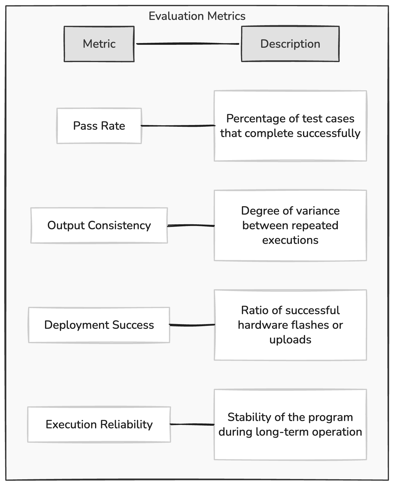

# Experiments

## Overview

When evaluating an experimental system, it is important to first consider the primary goal of the tool being studied. The goal of GDBuddy is to provide educators and students with a platform for evaluating embedded programs on real hardware while receiving timely feedback with minimal setup. Traditional continuous integration (CI) systems are widely used in software development to automatically build and test code. These systems are typically designed for standard software environments and do dno support testing programs that must run on embedded hardware. As a result, instructors and students working with embedded systems often rely on manual testing, which slows developments and makes it difficult to provide timely feedback on assignments especially outside of the classroom.

GDBuddy addresses this limitation by integrating physical hardware devices into an automated CI workflow. By connecting supported developments boards to a HiL based runner allows code pushed to a repository to be automatically compiled, flashed to hardware, and executed as a part of a CI pipeline. This approach allows embedded assignments to be tested on real devices in a manner similar to ow traditional software projects are validated through automated testing frameworks.

In order to evaluate the effectiveness of GDBuddy, two different types of experiments were conducted. The first experiment focused on automated test case validation. This experiment examined whether programs that pass a set of predefined test cases in a local development environment also pass when executed through the GDBuddy runner. The second experiment focused on hardware LED pattern verification using the Raspberry Pi Pico WH and the Arduino Uno. This experiment evaluated whether the system can reliably deploy programs that interact with physical hardware and produce observable behavior on the connected devices. 

Together these experiment evaluate both the functional correctness of code executed through the runner and the systems ability to interact with hardware components in an automated workflow. By examining both software level validation and hardware level behavior, the experiments provide a comprehensive evaluation of GDBuddy's usefulness as a hardware-in-the-loop testing platform for embedded systems development. 

## Experimental Design

DELETE 
Especially as it pertains to responisble computing, if conducting experiments or
evaluations that involve particular ethical considerations, detail those issues here.

### Research Questions

RQ1: Can GDBuddy reliably execute embedded programs through GitHub Actions?

RQ2: Do programs executed through the runner produce identical results to local execution?

RQ3: Can the systems reliably interact with physical hardware components and produce observable behavior?

### Experimental Workflow

This figure illustrates te overall workflow of the GDBuddy system. The process begins when a developer or student pushes code to a GitHub repository connected to an active runner device. This triggers a GitHub Actions workflow. This workflow is configured to t utilize the GDBuddy runner, which is hosted on a Raspberry Pi Pico WH or an Arduino Uno. The runner is responsible for orchestrating the compilation, deployment, and execution of the submitted program on the target hardware. 

Once the workflow is triggered the runner retrieves teh repository contents and initiates the appropriate build process depending on the target platform. For Arduino based programs, this involves invoking the Arduino CLI to compile and upload the code, while Raspberry Pi PIco programs are compiles using the Pico SDK and flashed onto the device. After the program is successfully deployed it is executed directly on the hardware. During execution, output is captured through a serial connection and returned to the CI  environment, where ti can be analyzed against expected results or displayed to the user as feedback.

This workflow demonstrates how GDBuddy extends traditional CI pipelines to support hardware-in-the-loop testing. By automating the process of compiling and executing code on physical devices, the system removes the need for manual testing and enables rapid feedback for embedded systems development. THis is particularly beneficial in educational settings, where consistent and timely evaluation of student code is essential.

Understanding the workflow of GDBuddy is crucial for understanding how to evaluate its performance and effectiveness. Given that the workflow is designed to be seamless and automated, while still providing a consistent environment and feedback loop for users this means that if a specific environment is set for an assignment and the students code passes all checks or produces the expected result locally, then it should also pass when executed through the GDBuddy runner. This is a key aspect of the systems design, as it ensures that automated testing through the CI pipeline is reliable and consistent with local development practices. This is one of the key ways in which GDBuddy will be evaluated in the experiments, by comparing the result of local execution with the results obtained through the runner to determine if they are consistent and reliable. 

## Experimental Methodology

The experiments were designed to evaluate GDBuddy in a controlled and repeatable manner by comparing program behavior across two execution environments: local development and hardware-in=the-loop CI execution. Each experiment follows a consistent methodology in which a program is first developed and tested locally, and then executed through the GDBuddy runner using a GitHub Actions workflow. 

For each test case, the expected output or behavior of the program is defined in advance. The program is then executed locally to establish a baseline for correctness. After verifying local correctness, the same code is committed to a repository, triggering the CI pipeline. The GDBuddy runner compiles, deploys, and executes the program on the target hardware, and the resulting output is collected and compared gainst the expected results. 

To ensure reliability, each experiment is executed multiple times across both supported platforms (Raspberry Pi Pico WH and Arduino Uno). While they will not be given the same exact test cases, the experiments are designed to evaluate similar functionality and behavior across both platforms to provide a comprehensive assessment of GDBuddy's capabilities. 

### Variables and Metrics

To evaluate the effectiveness of GDBuddy, several variables and metrics were considered.

1. **Independent Variable** 

- Execution Environment (Local vs CI runner)

- Target Platform (Raspberry Pi Pico WH vs Arduino Uno)

2. **Dependent Variable**

- Test case pass rate

- Output correctness

- Successful deployment rate

- Hardware execution success rate

Based on the metrics stated above, the evaluation of GDBuddy will focus on deterministic repeatability across both hardware platforms. 

### Platform Configuration

The experiments were conducted using two different hardware platforms, the Arduino Uno and the Raspberry Pi Pico WH. These platforms were selected due to their widespread use in educational settings.

The Arduino Uno utilizes the Arduino CLI for compilation and uploading, providing a relatively straightforward development workflow. In contrast, the Raspberry Pi Pico WH uses the Pico SDK and requires a separated build process and flashing mechanism. These differences allow the experiments to evaluate GDBuddy across multiple embedded development environments. 

Both devices were connected to a linux machine via USB connection. Serial communication was used to capture the program output during execution. THis configuration ensures that all experiments are performed within a consistent hardware-in-the-loop environment. 

### Experimental Assumptions

The experimental design assumes that the local development environment produces correct and deterministic results. This means that local execution is used aas a baseline for comparison against the CI-based execution. It is also assumed that the hardware devices behave consistently across repeated runs under the same conditions. 

## Evaluation

## Experiment 1: Test Case Validation

The objective of this experiment is to evaluate whether GDBuddy can reliably execute embedded programs through a continuous integration pipeline while producing results consistent with local execution. Specifically, this experiment aims to determine whether programs that pass a predefined set of test cases in a local development environment also pas when executed on physical hardware through the GDBuddy runner. 

This experiment directly addresses Research questions 1 and 2 by focusing on execution reliability and output consistency between local and CI-based environments. 

### Experimental Setup

To conduct this experiment, a set of embedded programs were developed for both Arduino Uno and the Raspberry Pi Pico WH. Each of the programs were designed to produce a deterministic output that could be evaluated against predefined test cases. The test cases were structured in a way that the expected output was known in advance and could compare directly to the output produced during execution. 

The local development environment consisted of standard toolchains for each platform, including the Arduino CLI for Arduino programs and the Pico SDK for the Raspberry Pi PIco programs. Programs were first compiled and executed locally to verify correctness prior to being tested within the CI pipeline. 

For CI-based execution, the same programs were committed to a GitHub repository and then configured and evaluated using the GDBuddy self hosted runner. The runner is hosted on a Linux-based system, and was connected to the given hardware devices via USB. 

### Procedure

The experiment followed a conssitenn procedure for both platforms.

1. A program was implemented and tested locally to ensure it passed all predefined test cases.

2. The expected output for each test case was recorded. 

3. The program was committed and pushed to the repository, triggering the GitHub Actions workflow.

4. The GDBuddy runner retrieved the code, compiled it and deployed it to the target hardware. 

5. The program was executed on the hardware and the output was captured via serial connection.

6. The captured output was compared against the expected results to determine correctness.

This process was repeated 10 times for each program to evaluate consistency and reliability across multiple runs. There were 2 different programs tested on each platform, which means that a total of 40 runs were conducted across both platforms (20 runs per platform).

INSERT TABLE WITH RESULTS HERE

## Experiment 2: Hardware LED Pattern Verification

**Objective**

The object of this experiment is to evaluate GDBuddy's ability to reliably execute programs that interact with physical hardware components. Unlike the previous experiment, which focuses on validating program output, this experiment emphasizes observable hardware behavior. Specifically, it aims to determine whether GDBuddy can consistently deploy and execute programs that produce a predefined LED blinking patter n on embedded devices. 

This experiment primarily addresses Research Question 3 by evaluating the systems ability to control hardware peripherals and produce consistent, repeatable e physical output. 

### Experimental Setup

## Threats to Validity
