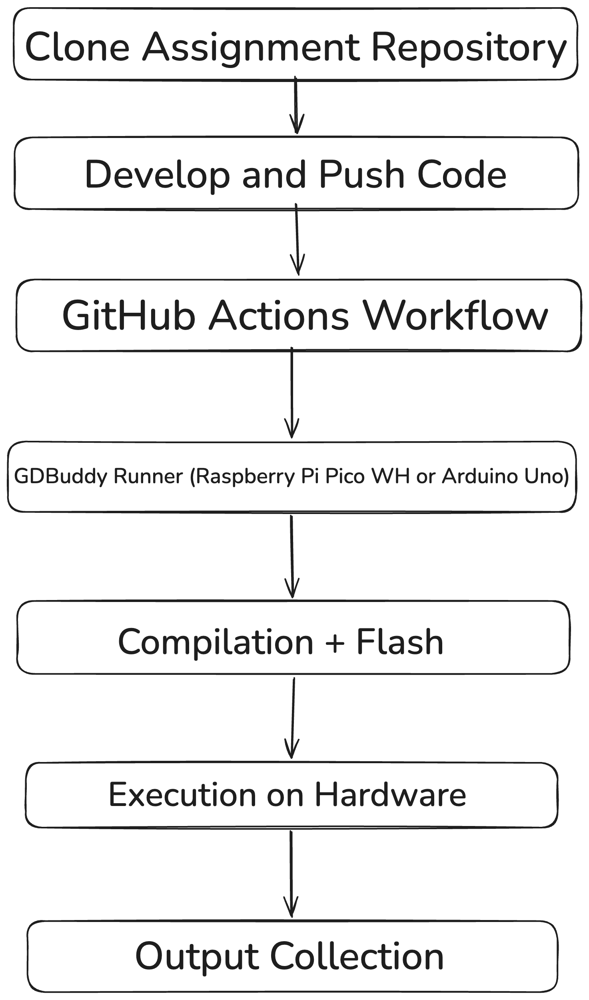

# Experiments

## Overview

When evaluating an experimental system, it is important to first consider the primary goal of the tool being studied. The goal of GDBuddy is to provide educators and students with a platform for evaluating embedded programs on real hardware while receiving timely feedback with minimal setup. Traditional continuous integration (CI) systems are widely used in software development to automatically build and test code. These systems are typically designed for standard software environments and do not support testing programs that must run on embedded hardware. As a result, instructors and students working with embedded systems often rely on manual testing, which slows development and makes it difficult to provide timely feedback on assignments especially outside of the classroom.

GDBuddy addresses this limitation by integrating physical hardware devices into an automated CI workflow. By connecting supported development boards to a HiL based system allows code pushed to a repository to be automatically compiled, flashed to hardware, and executed as a part of a CI pipeline. This approach allows embedded assignments to be tested on real devices in a manner similar to how traditional software projects are validated through automated testing frameworks.

In order to evaluate the effectiveness of GDBuddy, a primary Hardware-in-the-Loop experiment was conducted.The experiment focused on hardware LED pattern verification using the Raspberry Pi Pico WH and the Arduino Uno. This experiment evaluated whether the system can reliably deploy programs that interact with physical hardware and produce observable behavior on the connected devices. 

Ultimately this experiment evaluates both the functional correctness of code executed through the runner and the system's ability to interact with hardware components in an automated workflow. By examining hardware level execution behavior, the experiments provide a comprehensive evaluation of GDBuddy's usefulness as a Hardware-in-the-Loop testing platform for embedded systems development. 

### Research Questions

- **Research Question 1: Can GDBuddy reliably execute embedded programs through GitHub Actions?**

- **Research Question 2: Can GDBuddy produce consistent and repeatable execution results across hardware runs?**

- **Research Question 3: Can the systems reliably interact with physical hardware components and produce observable behavior?**

### Experimental Workflow

Figure 4A - GDBuddy Workflow Diagram

This figure illustrates the overall workflow of the GDBuddy system. The process begins when a developer or student pushes code to a GitHub repository connected to an active runner device. This triggers a GitHub Actions workflow. This workflow is configured to t utilize the GDBuddy runner, which is hosted on a Raspberry Pi Pico WH or an Arduino Uno. The runner is responsible for orchestrating the compilation, deployment, and execution of the submitted program on the target hardware. 

Once the workflow is triggered the runner retrieves the repository contents and initiates the appropriate build process depending on the target platform. For Arduino based programs, this involves invoking the Arduino CLI to compile and upload the code, while Raspberry Pi PIco programs are compiled using the Pico SDK and flashed onto the device. After the program is successfully deployed it is executed directly on the hardware. During execution, output is captured through a serial connection and returned to the CI  environment, where it can be analyzed against expected results or displayed to the user as feedback.

This workflow demonstrates how GDBuddy extends traditional CI pipelines to support Hardware-in-the-Loop testing. By automating the process of compiling and executing code on physical devices, the system removes the need for manual testing and enables rapid feedback for embedded systems development. THis is particularly beneficial in educational settings, where consistent and timely evaluation of student code is essential.

Understanding the workflow of GDBuddy is crucial for understanding how to evaluate its performance and effectiveness. Given that the workflow is designed to be seamless and automated, while still providing a consistent environment and feedback loop for users this means that if a specific environment is set for an assignment and the students code passes all checks or produces the expected result locally, then it should also pass when executed through the GDBuddy runner. This is a key aspect of the systems design, as it ensures that automated testing through the CI pipeline is reliable and consistent with local development practices. This is one of the key ways in which GDBuddy will be evaluated in the experiments, by comparing the result of local execution with the results obtained through the runner to determine if they are consistent and reliable. 

## Experimental Methodology

The experiments were designed to evaluate GDBuddy in a controlled and repeatable manner by comparing program behavior across two execution environments: local development and Hardware-in-the-Loop CI execution. Each experiment follows a consistent methodology in which a program is first developed and tested locally, and then executed through the GDBuddy runner using a GitHub Actions workflow. 

For each test case, the expected output or behavior of the program is defined in advance. The program is then executed locally to establish a baseline for correctness. After verifying local correctness, the same code is committed to a repository, triggering the CI pipeline. The GDBuddy runner compiles, deploys, and executes the program on the target hardware, and the resulting output is collected and compared against the expected results. 

To ensure reliability, each experiment is executed multiple times across both supported platforms (Raspberry Pi Pico WH and Arduino Uno). While they will not be given the same exact test cases, the experiments are designed to evaluate similar functionality and behavior across both platforms to provide a comprehensive assessment of GDBuddy's capabilities. 

### Variables and Metrics

To evaluate the effectiveness of GDBuddy, several variables and metrics were considered.

1. **Independent Variable** 

- Execution Environment (Local vs CI runner)

- Target Platform (Raspberry Pi Pico WH vs Arduino Uno)

These independent variables were chosen to evaluate GDBuddy across different execution environments and hardware configurations. The inclusion of multiple platforms allows the system to be assessed for generality, while the comparison between local validation and CI-based execution provides a baseline for expected behavior. 

2. **Dependent Variable**

- Deployment Success Rate: The percentage of runs in which the program was successfully compiled and flashed to the device.

- Execution Success Rate: The percentage of runs in which the program executed successfully on the hardware without runtime failures. 

- Pattern Accuracy: Whether the observed LED pattern matched the expected sequence.

- Run-to-Run Consistency: The degree to which repeated executions of the same program produce the same results across multiple runs.

Deployment Success Rate is critical because it evaluates the reliability of the CI pipeline's integration with physical hardware. In a Hardware-in-the-Loop system, successful deployment is a prerequisite for any further evaluation. Failures at this stage would indicate issues in toolchain configuration, device communication, or pipeline orchestration. Therefore, this metric directly measures the robustness of the system's ability to bridge software workflows with embedded hardware. Along with this Execution Success Rate is also an important metric to take into account. Execution Success Rate captures whether the system is capable of not only deploying code, but also executing it correctly on the target device. It is particularly important in embedded systems, where successful flashing does not guarantee correct runtime behavior. By separating execution success from deployment success, this metric ensures that failures in runtime behavior are independently identified. These two metrics are vital for evaluating the robustness of the CI pipeline however pattern accuracy is essential for evaluating the functional correctness of the executed program. This metric serves as the primary measure of functional correctness in the experiment. Since the LED pattern is deterministic and easily observable, it provides a clear and direct mapping between program logic and physical output. Pattern accuracy is therefore an effective proxy for verifying that the program executed as intended on the hardware. Lastly it is vital that the system is consistent across runs. Run-to-Run Consistency is essential for assessing the reliability of GDBuddy as a CI system. Continuous integration environments require deterministic behavior, where identical inputs produce identical outputs across repeated executions. Any variation between runs could indicate instability in the hardware, communication pipeline, or execution environment. Therefore, this metric directly measures the system’s ability to provide consistent and reproducible results.

Together, these metrics provide a comprehensive evaluation of GDBuddy by addressing three key aspects of system performance:

- Pipeline Reliability (Deployment Success Rate)

- Execution Stability (Execution Success Rate)

- Functional Correctness (Pattern Accuracy)

- Deterministic Behavior (Run-to-Run Consistency)

By combining these dimensions, the evaluation ensures that both the software and hardware aspects of the system are thoroughly assessed.

### Platform Configuration

The experiments were conducted using two different hardware platforms, the Arduino Uno and the Raspberry Pi Pico WH. These platforms were selected due to their widespread use in the embedded systems world having a large supporting base and infrastructure.

The Arduino Uno utilizes the Arduino CLI for compilation and uploading, providing a relatively straightforward development workflow. In contrast, the Raspberry Pi Pico WH uses the Pico SDK and requires a separate build process and flashing mechanism. These differences allow the experiments to evaluate GDBuddy across multiple embedded development environments. 

Both devices were connected to a linux machine via USB connection. Serial communication was used to capture the program output during execution. This configuration ensures that all experiments are performed within a consistent Hardware-in-the-Loop environment.

### Test Case Design

The physical setup for both experimental platforms required careful attention to ensure consistent and reproducible results across all test runs. For the Arduino Uno, the onboard LED connected to digital pin 13 was utilized for pattern verification. This LED is directly integrated into the board's design and requires no external wiring, simplifying the setup and eliminating potential connection issues. The Arduino was powered through its USB connection to the host machine, which simultaneously provided power delivery and serial communication capabilities.

The Raspberry Pi Pico WH configuration was more involved due to the absence of a builtin user controllable LED in the same manner as the Arduino. For these experiments, GPIO pin 25 was used, which on the Pico WH variant connects to an onboard LED. This pin was configured as a digital output in the test program, with the LED state controlled through direct GPIO manipulation using the Pico SDK's hardware abstraction layer. Like the Arduino, the Pico was powered and programmed through its micro USB connection, which serves the dual purpose of providing 5V power from the host and enabling firmware upload through the USB.

The simplicity of the LED based test cases was intentional to ensure that the expected output was deterministic and easily observable. By using onboard LEDs, the experiments avoided potential issues with external wiring or component variability, which could introduce additional sources of error. This design choice allowed for a clear focus on evaluating GDBuddy's ability to reliably execute code that interacts with hardware components, while minimizing confounding factors related to physical setup.

### Experimental Assumptions

The experimental design assumes that the local development environment produces correct and deterministic results. This means that local execution is used as a baseline for comparison against the CI-based execution. It is also assumed that the hardware devices behave consistently across repeated runs under the same conditions.

In addition, the experiments assume that the physical hardware is connected to the correct USB ports and GPIO pins, and that the host machine has stable access to those ports for both power and data. For the Arduino Uno, the USB connection must provide both reliable power and serial communication, and the onboard pin 13 LED must function properly. For the Raspberry Pi Pico WH, the micro USB connection must support firmware flashing and serial output, and GPIO pin 25 must be electrically functional and able to drive the onboard LED.

The design further assumes that the electrical characteristics of the hardware are sound: signal levels are within expected voltage ranges, the device ground is shared correctly with the host, and there are no intermittent loose connections or power issues that could affect runtime behavior. These hardware-level assumptions are necessary to isolate GDBuddy's software and CI workflow performance from unrelated electrical or connection problems.

### Experimental Setup

To conduct this experiment, a set of embedded programs were developed for both Arduino Uno and the Raspberry Pi Pico WH. Each of the programs were designed to produce a deterministic output that could be evaluated against predefined test cases. The test cases were structured in a way that the expected output was known in advance and could compare directly to the output produced during execution. 

The local development environment consisted of standard toolchains for each platform, including the Arduino CLI for Arduino programs and the Pico SDK for the Raspberry Pi PIco programs. Programs were first compiled and executed locally to verify correctness prior to being tested within the CI pipeline. 

For CI-based execution, the same programs were committed to a GitHub repository and then configured and evaluated using the GDBuddy self hosted runner. The runner is hosted on a Linux-based system, and is connected to the given hardware devices via USB. 

## Experiment: Hardware LED Pattern Verification

The object of this experiment is to evaluate GDBuddy's ability to reliably execute programs that interact with physical hardware components. Unlike the previous experiment, which focuses on validating program output, this experiment emphasizes observable hardware behavior. Specifically, it aims to determine whether GDBuddy can consistently deploy and execute programs that produce a predefined LED blinking pattern on embedded devices. 

This experiment primarily addresses Research Question 3 by evaluating the systems ability to control hardware peripherals and produce consistent, repeatable e physical output. 

### Experimental Setup

To conduct this experiment LED-based programs were developed for both the Arduino Uno and the Raspberry Pi PIco WH. Each program was designed to produce a specific and deterministic blinking pattern using an onboard or externally connected LED. 

The LED patterns were structured as a sequence of ON and oFF states with fixed timing intervals. These patterns were intentionally designed to be simple but recognizable, allowing for clear visual verification of correctness during execution. 

As in the previous experiment programs were first developed and tested locally to confirm that the expected ELD pattern was produced. Once verified, the programs were committed to a GitHub repository configured with a CI workflow utilizing the GDBuddy runner. 

The runner, hosted on  a Linux system, was connected to both devices via USB. Upon execution the program was deployed to the hardware, and the resulting LED behavior was observed and recorded. 

### Procedure

The experiment followed these steps for both platforms:

1. A specific wiring configuration was established to connect the LED's to the appropriate GPIO pins on each device. 

2. An LED control program was developed to produce a predefined blinking pattern.

3. The program was tested locally to verify the correct LED pattern was produced.

4. The code was committed and pushed to the repository triggering the GitHub Actions workflow. 

5. The GDBuddy runner compiled and deployed the program to the target device. 

6. The LED behavior was  observed and recorded during execution on the hardware. 

7. The observed LED pattern was compared against the expected pattern to determine correctness.

This process was repeated 20 times for each program to evaluate consistency and reliability across multiple runs.

## Results

The LED Pattern Verification experiment was conducted across two embedded platforms: the Arduino Uno and the Raspberry Pi Pico WH. Each program was executed 20 times per device and 40 total experimental runs across the system. 

Across all runs, the GDBuddy CI pipeline successfully executed the full workflow consisting of compilation, deployment, and hardware execution. In all recorded cases, the system was able to complete the GitHub Actions workflow and transfer execution control to the embedded devices through the Hardware-in-the-Loop runner. 

### Execution Success Rate

Both the Arduino Uno and the Raspberry Pi Pico WH achieved a 100% Execution success rate, meaning that in all test runs the system was able to:

- Successfully trigger the GitHub Actions Workflow

- Build and compile the embedded program

- Deploy the compiled binary to the target hardware device

- Execute the program on the device without runtime failure

This result indicates that the CI to hardware pipeline was stable under repeated execution.

### Deployment Success Rate

Deployment success rate measures the percentage of runs in which the program was successfully compiled and flashed onto the target device. 

Across all experimental runs, both platforms achieved a 100% deployment success rate. In every case, the GDBuddy runner successfully:

- Retrieved the repository contents

- Compiled the embedded program 

- Flashed the compiled binary to the target hardware 

### Pattern Accuracy

Pattern accuracy evaluates whether the observed LED behavior matched the expected blinking pattern defined in the program.Across all runs, both platforms demonstrated 100% pattern accuracy, with each execution producing the correct LED sequence. No deviations from the expected behavior were observed during testing. 
This confirms that the system not only executes programs successfully but also preserves functional correctness during hardware execution. 

### Run-to-Run Consistency

This metric assesses whether repeated executions of the same program produce identical observable behavior across multiple runs. Across all 40 runs, both platforms exhibited fully consistent behavior, with no variation in LED timing patterns or sequence order between executions. Each run produced the identical results under the same input conditions. This demonstrates that GDBuddy is capable of deterministic and repeatable hardware execution, which is a critical requirement for reliable CI-based testing. 

### Discussion 

This experiment demonstrates GDBuddy's capability to support Hardware-in-the-Loop testing beyond simple output validation. By successfully executing programs that produce observable physical behavior, the system proves its ability to interact directly with embedded hardware components in an automated CI environment.

The consistency of LED patterns across multiple runs indicate that GDBuddy can reliably deploy and execute hardware dependent programs. THis is particularly significant because hardware interaction introduces additional complexity compared to standard software execution, including timing dependencies and device communication. 

In an educational context, this capability enables instructors to design assignments that require not only correct program output but also correct hardware behavior. As a result, GDBuddy expands the scope of what can be automatically tested within embedded systems courses. 

## Threats to Validity

Several factors may influence the validity of the experimental results presented in this study. These threats are categorized into internal, construct, and external validity, along with system-level scalability limitations.

### Internal Validity

Internal validity refers to whether the results are a product of the GDBuddy system rather than other factors that may have been influenced by experimental design or other accounted for factors. 

One limitation of this experiment is that LED pattern correctness was verified through visual observation While the blinking patterns were designed to be simple and easily recognizable, manual observation introduces the possibility of human error in pattern recognition. 

Additionally, hardware timing behavior may vary slightly due to microcontroller clock differences or other inconsistencies in execution timing. Although no inconsistencies were observed during testing, these factors could influence results in less controlled environments. 

### External Validity

This refers to the degree in which these results can be generalized beyond the experimental setup.

This experiment was conducted using the two specific hardware platforms that GDBuddy is compatible with. While these platforms are widely used in a variety of settings, the results would not generalize to other embedded devices or microcontrollers. 

Additionally, all experiments were conducted in a controlled environment with consistent hardware and stable connections. In other settings there may be additional variability in hardware such as wiring configuration, device quality, user behavior, or USB communication stability that could impact results. 

### Construct Validity

Construct validity concerns whether the experiment accurately measures the intended system properties. 
In this study, LED blinking patterns were used as a proxy for program correctness. While this approach is effective for validating deterministic execution and hardware interaction, it does not capture the full complexity of embedded systems behavior. For example, the experiment does not evaluate sensor input handling, or possible test case evaluation. As a result, while pattern accuracy confirms correct execution for simple deterministic programs, it may not fully represent the correctness for more complex embedded system applications, especially those that involve non-deterministic behavior or dynamic input.

### Scalability Limitations

The current evaluation focuses on using device execution within the CI pipeline. The system was not tested with multiple runner devices executing concurrently, which would require additional work to manage device allocation and workflow orchestration. As a result, the current results may not generalize whenever it comes to larger scale deployments with multiple devices or more complex workflows. As there is only one runner device the system is limited to executing one workflow at a time, which may be sufficient in some contexts but could become a bottleneck in much larger settings with many different users frequently pushing code and triggering workflows. 

### Future Work

There are several opportunities to extend and improve the GDBuddy system based on the findings of this study. 

- **Automated Output Verification**: Future iterations of GDBuddy could integrate automated output verification mechanisms, such as using a camera to capture LED patterns and applying computer vision techniques to analyze correctness. This would eliminate the need for manual observation and reduce the potential for human error in pattern recognition.

Along with this, the system could extend support to be able to capture and analyze other types of hardware output, such as sensor readings, serial output, or test case outputs to provide a more comprehensive evaluation of embedded program behavior.

- **Support for Additional Hardware**: Expanding GDBuddy's compatibility to include a wider range of embedded devices and microcontrollers would increase its applicability. This could involve adding support for platforms like ESP32, STM32, or other popular development boards.

- **Scalability Improvements**: Enhancing the system's ability to handle multiple concurrent workflows and devices would improve its performance in larger-scale deployments. This could involve optimizing device management and workflow orchestration mechanisms that would allow multiple runner devices to be utilized simultaneously, enabling more users to test their code without waiting for a single device to become available.