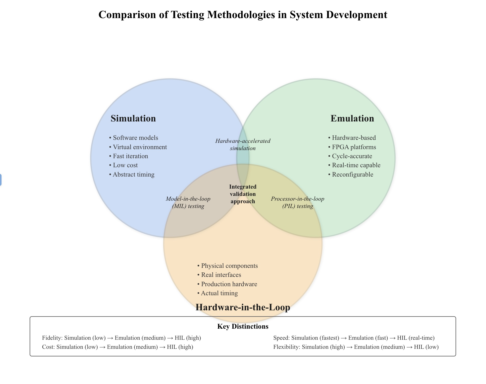
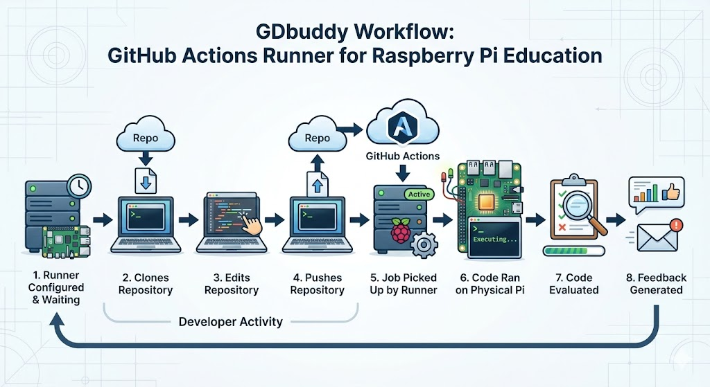

# Introduction

My senior comprehensive project, GDBuddy, is a Hardware-in-the-Loop (HiL) runner designed for the Raspberry Pi Pico WH as well as the Arduino Uno. It operates through a Docker container that runs within GitHub Actions, enabling seamless integration with existing continuous integration (CI) workflows. In its current form, GDBuddy is used in the education sector. With an active GDBuddy runner, assignments that are pushed to GitHub can be run on a real embedded system. While the developers software is running GDBuddy evaluates its behavior against predefined requirements and provides real-time feedback directly on GitHub. This workflow creates a consistent and efficient testing-feedback loop for developers, improving code reliability and quality. [@RaspberryBasics2023book]

## Motivation

The development of GDBuddy was influenced by the need to better understand and improve the user experience for both students and instructors as well as developers using the tool. Experiences with GDBuddy revealed that many users benefited from its services but had limited understanding of its inner workings from a development standpoint. This motivated a deeper exploration into how the tool operates and how it could be refined to meet the needs of all users. By examining GDBuddy from both a production and user perspective, this project aims to bridge the gap between usability, functionality, and developmental effectiveness.

To properly contextualize GDBuddy's significance and advantages, it is essential to first understand the limitations of more conventional testing approaches. Simulation-based testing has long been the standard method for validating embedded systems, particularly in collaborative settings where cost and accessibility can be concerns. However, simulation alone cannot capture the complete behavior of embedded systems when they interact with real hardware. By examining these limitations, we can better appreciate why a Hardware-in-the-Loop approach like GDBuddy represents a meaningful advancement for development practices.

### Limitations of Simulation Based Testing

It is also important to note the benefits of a hardware in the loop system. In high end embedded system development the reliability of the system often depends on rigorous testing methodologies that go beyond your normal simulation based workflows. While software simulators can offer fast and useful testing in early development they inherently can not account for every aspect in the way that testing on real can. A few examples of these would be timing jitter, electrical noise, peripheral latency, memory constraints, and many other systems are often simplified when simulating. This leads to less accurate testing when compared to testing on physical hardware. 

### Simulation vs. Emulation

Emulation provides a more accurate approximation by modeling the hardware on a lower level. It does this by trying to model the same architecture, instruction set, and peripheral behavior of a device closely enough that unmodified firmware can run as if it were executing on the real hardware. Emulators mimic both the hardware and software of a real device whereas simulators replicate the behavior and environment of a device without imitating its hardware. This shows the clear difference between these two.

{#fig-sim-em-hil width=90% fig-align="center"}

This venn diagram goes to show the pros and cons of all of these different methods. Each has their own use in the testing process however some are more fit for certain roles than others. For example if testing for a car part that is essential to the braking system one would likely want to simulate and emulate this before trying to test it with HiL as it could be a safety concern.

While simulation and emulation provide valuable testing capabilities during early development, there are several categories of issues that can only be discovered through execution on physical hardware. Understanding these limitations provides essential context for why GDBuddy's Hardware-in-the-Loop approach offers meaningful advantages over purely virtual testing environments.

One of the most significant limitations involves timing behavior. Embedded systems often depend on precise timing relationships between hardware events, interrupt handlers, and program execution. Simulators typically model time as a logical construct rather than physical reality. While a simulator might correctly determine that Event A occurs before Event B, it cannot accurately reproduce the exact millisecond level timing that occurs on real hardware. This breaks down when code depends on instruction level timing, clock cycle counting, or the precise duration of hardware operations. For example, bit banging protocols where GPIO pins are toggled at specific intervals to implement custom communication schemes are nearly impossible to validate accurately in simulation because the timing must match the electrical characteristics of the target hardware.

Power consumption represents another area where simulation falls short. While advanced simulators can estimate power usage based on operation counts and theoretical models, they cannot account for the complex interactions between hardware components, voltage regulation, and thermal effects that influence real power consumption. Students writing battery powered embedded applications may develop code that appears efficient in simulation but exhibits poor battery life on actual hardware due to unexpected wake up cycles or suboptimal power state transitions.

Electrical characteristics and physical interfaces present yet another challenge. When a GPIO pin is configured as an output and set to a high logic level, the simulator simply records this state change. However, the physical pin must source current, drive a specific voltage level, and maintain that level against potential electrical noise or load conditions. Issues such as insufficient drive strength, incorrect pull up or pull down resistor configurations, or signal integrity problems only manifest when interacting with real electrical components. A developer might write perfectly logical code to control an external sensor, but discover that the voltage levels are incompatible or that electrical noise causes intermittent failures—problems that would never appear in simulation.

Memory constraints also behave differently in practice than in simulation. While simulators can enforce memory limits, they typically do so through artificial bounds checking rather than the actual physical limitations of the hardware. Real embedded systems exhibit specific failures when memory is exhausted, such as stack heap collisions, corrupted data structures, or unexpected resets. The exact behavior depends on the memory architecture, memory management unit configuration, and how the runtime system handles allocation failures. These specific behaviors are difficult to replicate accurately in simulation.

Furthermore, hardware specific bugs and limitations in the microcontroller are not typically represented in simulation environments unless the simulator is explicitly designed to include them. As a result, code that works correctly in a simulated setting may still fail when deployed to physical hardware due to these real world issues, which often require software level workarounds.

### Importance of Hardware-in-the-Loop Testing

Even the best emulators can not perfectly replicate real hardware. This is why Hardware-in-the-Loop testing is so important. It is the best method of testing if you are looking for accuracy and precision. HiL allows for test cases to be run under the exact electrical, timing, and performance conditions encountered by real users of the product. This approach can also help to expose hardware dependent issues such as timing violations, initialization inconsistencies, caching effects, thermal related behavior, along with a variety of other issues that are otherwise undetectable in a virtualized environment. 

### Role of Hardware-in-the-Loop in This Project

For this project HiL is one of the key components because of these reasons. With HiL testing through a GitHub Actions runner on a real Raspberry Pi it allows for an accurate and reproducible environment to produce test results on. Combining HiL with GitHub actions allows for accessible, automated, and scalable integration in education.

### Industry Context

{#fig-hil-vs-sil width=85% fig-align="center"}

As shown in Figure 1 of Balan et al. (2025), this is what a testing process might look like for a company that is selling a product to the open market. In this figure the design specification is on the left and the test execution is shown on the right. SiL stands for Software in the Loop. This involves testing software components in a simulated environment where software is executed on a virtual platform instead of physical hardware. This is often industry standard for the first round of testing as if the software can not run successfully on its own it probably does not work when integrated with a separate piece of hardware. The next level of testing is HiL. This is when the hardware component actually has the software running on it in real time. Where this setup differs from GDBuddy is when we start talking about ViL (Vehicle in the Loop). This is often done in the automotive industry but also translates to any project where multiple different parts are working together. Now that the specific part has been tested via HiL it is important to then test it with ViL to show that it can work with the surrounding systems and not just on its own. Ultimately if all of these tests pass then you can begin vehicle testing as a whole and feel confident that the various parts and systems that have been tested will work. 

While this type of workflow is not directly tied to GDBuddy it is a key example to show where simulation and HiL fit with each other and how they are different. In the project, GDBuddy focuses specifically on providing a low cost platform for HiL testing rather than simulation. Simulation allows developers to evaluate things such as logic, timing, and software correctness without needing physical hardware. This is valuable in early development and reduces risk; however, this alone cannot detect hardware dependent behaviors or failures that emerge only when firmware interacts with a real microcontroller.

### Contribution of GDBuddy

GDBuddy addresses this gap in the education sector by providing HiL testing for the Raspberry Pi as well as the Arduino Uno that is integrated with GitHub. This is a great advancement because so many of the HiL platforms that are used in different industries are so specific and complex to apply to other systems or sectors. The systems shown in Balan et al. (2025) are designed for automotive integration eventually progressing to ViL and full system validation. GDBuddy targets a similar conceptual role earlier and at a smaller scale: verifying that firmware not only compiles and runs in simulation, but behaves correctly on the target device before being evaluated. 

This example supports the motivation behind GDBuddy. While software can be tested in simulation for functional correctness only HiL can ensure that correctness in reality. GDBuddy creates a system that makes this technology easy to access by making HiL testing continuous, reproducible, and automated.

### Workflow

The figure shown above represents the workflow of GDBuddy. Something that is very noticeable is that if GitHub is already being used for assignments then students do not have to change anything they are doing at all. They simply clone the repository, complete the assignment, and then push the repository to GitHub. As long as a runner is active it will automatically pick up this assignment as a job. Activating the runner is a somewhat simple process. Simply connect your Device (Arduino or Pi) to your host machine, open the GDBuddy folder, enter your GitHub Personal Access Token(PAT) as well as your organization, and docker compose up. Once you do this it should only take a few minutes to authenticate and then it becomes an active runner that is waiting for jobs. Now that the runner is activated and a repository has been pushed this will automatically be picked up by the runner where it will then run the code on a physical device, evaluate it, then return the feedback to the developer. This is the base workflow of GDBuddy. 

{#fig-gbuddy-workflow width=90% fig-align="center"}

### Automating Embedded Testing

As far as functionality goes, testing embedded code typically requires manual steps such as flashing firmware to a device, observing physical behavior and then collecting results. These manual processes slow down iteration and can introduce some human error. This is the reason that GDBuddy was created, a tool that bridges the gap between cloud based CI workflows and physical hardware in the loop automation. By integrating the embedded device as a runner for GitHub Actions, GDBuddy enables developers to automatically build, deploy, and test their code on the real hardware. This ultimately brings great reproducibility and ease of use.

## Current State of the Art

In the current space there are a variety of HiL implementations available on GitHub. An example of this would be zephyr_twister_hil_testing repository, which demonstrates how to integrate real-hardware testing within GitHub Actions. This project provides an example where it compiles Zephyr's basic/blinky firmware in the cloud (using GitHub-hosted runners), then flashes it and runs it on a self hosted runner connected to the physical hardware. This repository also focuses on the Nordic nRF52840 Development Kit paired with an ESP32 modem.

This project is similar to GDBuddy in the sense that it is looking at HiL testing through GitHub actions. However there is a lot to contrast here. To start GDBuddy focuses on an entirely different embedded device, Raspberry Pi. Also the setup process is much more simple as there is only a docker container that can be set up and running in just a couple of steps. The opposing repository requires significant manual setup for both the runner hardware and firmware flashing scripts. In the context of education this could cause accessibility issues for some learners as well as instructors.

In summary while projects such as Golioth's zephyr_twister_hil_testing demonstrate technical feasibility of HiL testing within GitHub Actions, GDBuddy builds upon this concept by emphasizing accessibility, educational integration, and ease of deployment, making it better suited for the classroom environment. 

### Broader Landscape of Hardware-in-the-Loop Tools

Beyond GitHub workflows there are a number of industrial grade HiL frameworks that exist. One of these being LAVA (Linaro Automated Validation Architecture). This is used in large system testing like Linux Kernel Functional Testing or KernelCI. With this tool extra hardware may be required for some system tests and results are tracked over time with exportable data. There are other tools as well that operate in the large scale validations pipelines often running across multiple devices with a complex setup. This complexity and resource requirements make them impractical for academic environments where hardware resources and technical experience can be limited. GDBuddy looks to bridge this gap and make HiL accessible to students. 

### Limitations Existing In Educational HiL Platforms

While there are tools that assist in students running compiled code they are not integrated into CI workflows. These tools will often require manual test execution as well as custom environments. This means that there will be much more time used to create a strong feedback loop and that the feedback that you do give could be inconsistent due to environmental variables. GDBuddy improves this by using GitHub Actions, which many students and professionals already rely on, transforming testing from a manual process into a reproducible and trackable workflow. 

### Academic Tooling

A major distinction between GDBuddy and other projects is its emphasis on reproducibility and easy integration. Workflows run entirely through GitHub pipelines so instructors can grade, and reproduce students' results across different classes and semesters. This turns embedded programming assignments into testable CI artifacts rather than submissions evaluated only by manual observation. Additionally, GDbuddy using a docker container for setup allows for the entry barrier for new users to be lowered compared to other HiL testing tools. 

### Raspberry Pi Ecosystem

The Raspberry Pi ecosystem features a large number of remote execution and debugging tools such as PiGPIOD, remote GDB stubs, and remote SSH automation scripts. While useful they were not originally designed as CI integrated HiL workflows. GDBuddy builds on these tools by packaging debugging, deployment, workflow organization, and runner lifecycle management into a single tool. This makes it one of the first projects to treat the Raspberry Pi as a first class target meaning that instead of SSH into it and manually running code jobs are automatically queued and executed on the Pi.

### Arduino Uno Ecosystem

The Arduino Uno community also includes many helpful tools for remote development, like avrdude for flashing, serial bridge utilities for monitoring runtime output, and Arduino CLI workflows that automate build and upload steps. These tools were built with convenient prototyping in mind, not with continuous integration or Hardware-in-the-Loop testing as the primary goal. GDBuddy extends this ecosystem by wrapping those device-specific capabilities into an integrated CI-ready HiL experience, so Arduino Uno firmware can be deployed, exercised, and validated on real hardware through an automated pipeline instead of relying on manual flash-and-test cycles.

## Goals of the Project

The primary goal of GDBuddy is to enhance the accessibility and automation in Hardware-in-the-Loop testing for the Raspberry Pi platform. While HiL testing is widely used in a variety of different sectors such as automotive safety systems and industrial control systems most of the available HiL systems are expensive and require specialized hardware. As a result of this HiL is often inaccessible to students or independent developers. This often leads to more simulation based testing. GDBuddy addresses this gap by first off being integrated with an already popular embedded device in education. In combination with this it is already integrated with GitHub Actions. By doing this it allows for this platform to be accessible to far more people than it was before.

### Goal 1: Automated Hardware Testing

The first objective of this project is to enable automated HiL testing directly within GitHub Actions. Instead of relying on simulation, GDBuddy aims to run the code directly on the selected device. Whenever the code is run on the device it then retrieves a functional output and then evaluates if the code passes the various test cases for the given assignment and returns the results to the student through the GitHub Actions pipeline. This allows students or developers to treat physical hardware as a test runner. This goal is essential because embedded systems often contain hardware dependent logic and also have various restrictions such as available memory that can not be tested through simulation alone. A successful implementation will allow contributors to push code, trigger CI workflows, and receive verification that their code behaves correctly in a real physical environment without ever needing direct access to the hardware.

### Goal 2: Simplified Setup Process

A major issue with making HiL accessible is the complexity of establishing a working environment. Many existing HiL platforms have complex toolchains, customized kernels, or specialized lab equipment. These constraints make deployment impractical in academic settings where instructors have to support dozens of students with varying backgrounds in technology. GDBuddy addresses this obstacle by providing a reproducible Docker based environment. This setup should only require a student to clone a repository and then push their changes. If they are in the proper workspace then the job should automatically be picked up by the runner. The simplicity of this project also extends its long term maintainability. Instead of having to install a traditional toolchain it is containerized through Docker. This reduces the instructor's burden and also lowers the experience level needed to use GDBuddy. Along with this it allows for better reproducibility across environments. 

### Goal 3: Scalability and Reliability

The third goal is to ensure that GDBuddy remains scalable beyond a single device. In the future this tool will hopefully be compatible with various microcontrollers. Another way that scalability would be increased is to be able to handle and have multiple runners available at all times. As of now it is dependent on the time of year or day whether runners are available however if there were more users and more runners it is likely the GDBuddy could scale efficiently as long as there is a relatively good ratio between the amount of runners and active jobs. GDBuddy also incorporates automated recovery mechanisms ensuring that the runner remains available without constant supervision which is also great for reliability.

## Ethical Implications

### Security Risks for Remote Execution

GDBuddy proposes a few different ethical considerations related to security, misuse, and responsible deployment. The most immediate concern is the potential execution of malicious or harmful code on the physical Raspberry Pi used as the runner. GitHub Actions workflows can trigger builds and tests automatically and an unsecure runner could become a target for unauthorized job execution leading to manipulation of the attached hardware. Ensuring that the runner is configured to accept jobs only from authenticated sources is something that would be essential given these safety concerns. 

### Trust in Third Party Platforms

Another main ethical concern would be the reliance on a variety of GitHubs systems to work in a secure fashion so the tool can not be manipulated. It is first assumed that GitHub would not give access to the organization where runners can be created. It is also assumed that the runners' GitHub Personal Access Token (PAT) is uncompromised as it is required for authentication to create a runner. All of these factors place an ethical obligation to develop this with the best industry practices in mind in order to prevent such issues. 

### Hardware Consequences

In addition to cyber security risks HiL systems introduce ethical considerations related to physical consequences. Unlike traditional CI workflows that operate purely in software a HiL runner controls real hardware that may interact with external power systems or mechanical components. If malicious code is executed the device could physically overdraw power, damage connected devices, and in certain extreme cases pose safety risks to users or property. While GDBuddy is currently used for testing on Raspberry Pi's which are rather light weight, the ethical concern is still relevant because it establishes a precedent for remotely executing instruction on physical hardware. Future extensions of GDBuddy must enforce hardware safety constraints. 

### Data Privacy

Another ethical concern is how the data produced from testing is treated. There can be sensitive information such as network addresses or device identifiers. If these logs are uploaded to GitHub or transmitted over public networks private information could be at risk for exposure. The ethical fix for this is to protect sensitive data during transport and storage and to avoid collecting information that is not necessary for testing in the first place. Conforming to the best security practices would eliminate most of these issues to ultimately ensure that educational users developing insecure code are not exposed to privacy failures. 

### Equity, Access, And Educational Fairness

Finally, the integration of HiL testing in an educational environment raises concerns about equity and accessibility. If these systems were difficult to configure securely or required unprovided or expensive hardware there may be an advantage given to certain learners and the exclusion of others. GDBuddy attempts to break down these barriers through a simplified setup and also allowing the code to run on the educators runner as opposed to students having to have their own Raspberry Pi though they might find it useful. This tool provides the ability to run code from any device on an actual Raspberry Pi which can provide accessibility to this embedded system that somebody might not otherwise have. 