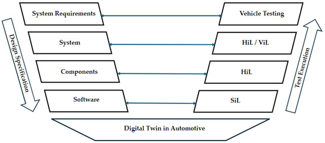

# Introduction

My senior comprehensive project, GDBuddy, is a hardware-in-the-loop (HIL) runner designed for the Raspberry Pi. It operates through a Docker container that runs within GitHub Actions, enabling seamless integration with existing continuous integration (CI) workflows. In its current form, GDBuddy is used in the education sector. With an active GDBuddy runner, assignments that are pushed to GitHub can be run on a real Raspberry Pi. While the students software is running GDBuddy evaluates its behavior against predefined requirements and provides real-time feedback directly on GitHub. This workflow creates a consistent and efficient testing-feedback loop for both instructors and students, improving code reliability and learning outcomes.

## Motivation

The development of GDBuddy was influenced by the need to better understand and improve the user experience for both students and instructors using the tool. Experiences with GDBuddy revealed that many users benefited from its services but had limited understanding of its inner workings from a development standpoint. This motivated a deeper exploration into how the tool operates and how it could be refined to meet the needs of both students and educators. By examining GDBuddy from both a production and user perspective, this project aims to bridge the gap between usability, functionality, and educational effectiveness.

It is also important to note the benefits of a hardware in the loop system. In high end embedded system development the reliability of the system often depends on rigorous testing methodologies that go beyond your normal simulation based workflows. While software simulators can offer fast and useful testing in early development they inherently can not account for every aspect in the way that testing on real can. A few examples of these would be timing jitter, electrical noise, peripheral latency, memory constraints, and many other systems are often simplified when simulating. This leads to less accurate testing when compared to testing on physical hardware. 

Emulation provides a more accurate approximation by modeling the hardware on a lower level. It does this by trying to model the same architecture, instruction set, and peripheral behavior of a device closely enough that unmodified firmware can run as if it were executing on the real hardware. Emulators mimic both the hardware and software of a real device whereas simulators replicate the behavior and environment of a device without imitating its hardware. This shows the clear difference between these two.

Even the best emulators can not perfectly replicate real hardware. This is why hardware-in-the-loop testing is so important. It is the best method of testing if you are looking for accuracy and precision. HIL allows for test cases to be ran under the exact electrical, timing, and performance conditions encountered by real users of the product. This approach can also help to expose hardware dependent issues such as timing violations, initialization inconsistencies, caching effects, thermal related behavior, along with a variety of other issues that are otherwise undetectable in a virtualized environment. 

For this project HIL is one of the key components because of these reasons. With using HIL testing through a GitHub Actions runner on a real Raspberry Pi it allows for an accurate and reproducible environment to produce test results on. Combining HIL with GitHub actions allows for accessible, automated, and scalable integration in education.

Figure 1A 

As shown in Figure 1 of Balan et al. (2025), this is what a testing process might look like for a company that is selling a product to the open market. In this figure the design specification is on the left and the test execution is shown on the right. SiL stands for Software in the Loop. This involves testing software components in a simulated environment where software is executed on a virtual platform instead of physical hardware. This is often industry standard for the first round of testing as if the software can not run successfully on its own it probably does not work when integrated with a separate piece of hardware. The next level of testing is HIL. This is when the hardware component actually has the software ran on it in real time. Where this setup differs from GDBuddy is when we start talking about ViL (Vehicle in the Loop). This often done in the automotive industry but also translates to any project where multiple different parts are working together. Now that the specific part has been tested via HIL it is important to then test it with ViL to show that it can work with the surrounding systems and not just on its own. Ultimately if all of these tests pass then you can begin vehicle testing as a whole and feel confident that the various parts and systems that have been tested will work. 

While this type of workflow is not directly tied to GDBuddy it is a key example to show where simulation and HIL fit with each other and how they are different. In the project, GDBuddy focuses specifically on providing a low cost platform for HIL testing rather than simulation. Simulation allows developers to evaluate things such as logic, timing, and software correctness without needing physical hardware. This is valuable in early development and reduces risk however, this alone cannot detect hardware dependant behaviors or failures that emerge only when firmware interacts with a real microcontroller.

GDBuddy addresses this gap in the education sector by providing HIL testing for the Raspberry Pi that is integrated with GitHub. This is a great advancement because so many of the HIL platforms that are used in different industries are so specific and complex to apply to other systems or sectors. The systems shown in Balan et al. (2025) are designed for automotive integration eventually progressing to ViL and full system validation. GDBuddy targets a similar conceptual role earlier and at a smaller scale: verifying that firmware not only compiles and runs in simulation, but behaves correctly on the target device before being evaluated. 

This example supports the motivation behind GDBuddy. While software can be tested in simulation for functional correctness only HiL can ensure that correctness in reality. GDBuddy creates a system that makes this technology easy to access by making HIL testing continuous, reproducible, and automated.

As far as functionality goes, testing embedded code typically requires manual steps such as flashing firmware to a device, observing physical behavior and then collecting results. These manual processes slow down iteration can introduce some human error. This is the reason that GDBuddy was created, a tool that bridges the gap between cloud based CI workflows and physical hardware in the loop automation. By integrating the Raspberry Pi as a runner for GitHub Actions, GDBuddy enables developers to automatically build, deploy, and test their code on the real embedded device. This ultimately brings great reproducibility and ease of use.

## Current State of the Art

In the current space there are a variety of HIL implementations available on GitHub. An example of this would be zephyr_twister_hil_testing repository, which demonstrates how to integrate real-hardware testing within GitHub Actions. This project provides an example where it compiles Zephyr's basic/blinky firmware in the cloud (using GitHub-hosted runners), then flashes it and runs it on a self hosted runner connected to the physical hardware. This repository also focuses on the Nordic nRF52840 Development Kit paired with an ESP32 modem.

This project is similar to GDBuddy in the sense that it is looking at HIL testing through GitHub actions. However there is a lot to contrast here. To start GDBuddy focuses on an entirely different embedded device, Raspberry Pi. Also the setup process is much more simple as there is only a docker container that can be set up and running in just a couple of steps. The opposing repository requires significant manual setup for both the runner hardware and firmware flashing scripts. In the context of education this could cause accessibility issues for some learners as well as instructors.

In summary while projects such as Golioth's zephyr_twister_hil_testing demonstrate technical feasibility of HIL testing within GitHub Actions, GDBuddy builds upon this concept by emphasizing accessibility, educational integration, and ease of deployment, making it better suited for the classroom environment. 

## Goals of the Project

The primary goal of GDBuddy is to enhance the accessibility and automation in hardware-in-the-loop testing for the Raspberry Pi platform. While HIL testing is widely used in a variety of different sectors such as automotive safety systems and industrial control systems most of the available HIL systems are expensive and require specialized hardware. As a result of this HIL is often inaccessible to students or independent developers. This often leads to more of simulation based testing. GDBuddy addresses this gap by first off being integrated with an already popular embedded device in education. In combination with this it is already integrated with GitHub Actions. By doing this it allows for this platform to be accessible to far more people than it was before.

Goal 1: Automated Hardware Testing
    The first objective of this project is to enable automated HIL testing directly within GitHub Actions. Instead of relying on simulation GDBuddy aims to run the code directly on the Raspberry Pi. Whenever the code is ran on the Raspberry Pi it then retrieves a functional output evaluate if the code passes the various test cases for the given assignment and returns the results to the student through the GitHub Actions pipeline. This allows students or developers to treat physical hardware as a test runner. This goal is essential because embedded systems often contain hardware dependant logic and also have various restrictions such as available memory that can not be tested through simulation alone. A successful implementation will allow contributors to push code, trigger CI workflows, and receive verification that there code behaves correctly in a real physical environment without ever needing direct access to the hardware.

Goal 2: Simplified Setup Process
    A major issue with making HIL accessible is the complexity of establishing a working environment. Many existing HIL platforms have complex toolchians, customized kernels, or specialized lab equipment. These constraints make deployment impractical in academic settings where instructors hae to support dozens of students with varying backgrounds in technology. GDBuddy addresses this obstacle by providing a reproducible Docker based environment. This setup should only require a student to clone a repository and then push there changes. If they are in the proper workspace then the job should automatically be picked up by the runner.

    The simplicity of this project also extends its long term maintainability. Instead of having to install a traditional toolchain it is containerized through Docker. This reduces the instructors burden and also lowers the experience level needed to use GDBuddy. Along with this it allows for better reproducibility across environments. 

Goal 3: Scalability and Reliability
    The third goal is to ensure that GDBuddy remains scalable beyond a single device. In the future this tool will hopefully be compatible with various microcontrollers. Another way that scalability would be increased is to be able to handle and have multiple runners available at all times. As of now it is dependant on the time of year or day whether runners are available however if there were more users and more runners it is likely the GDBuddy could scale efficiently as long as there a relatively good ratio between the amount of runners and active jobs. GDBuddy also incorporates automated recovery mechanisms ensuring that the runner remains available without constant supervision which is also great for reliability.

## Ethical Implications

GDBuddy proposes a few different ethical considerations related to security, misuse, and responsible deployment. The most immediate concern is the potential execution of malicious or harmful code on the physical Raspberry Pi used as the runner. GitHub Actions workflows can trigger builds and tests automatically and an unsecure runner could become a target for unauthorized job execution leading to manipulation of the attached hardware. Ensuring that the runner is configured to accept jobs only from authenticated sources is something that would be essential given these safety concerns. 

Another main ethical concern would be the reliance on a variety of GitHubs systems to work in a secure fashion so the tool can not be manipulated. It is first assumed that GitHub would not give access to the organization where runners can be created. It is also assumed that the runners' GitHub Personal Access Token (PAT) is uncompromised as it is required for authentication to create a runner. All of these factors place an ethical obligation to develop this with the best industry practices in mind in order to prevent such issues. 

In addition to cyber security risks HIL systems introduce ethical considerations related to physical consequences. Unlike traditional CI workflows that operate purely in software a HIL runner controls real hardware that may interact with external power systems or mechanical components. If malicious code is executed the device could physically overdraw power, damage connected devices, and in certain extreme cases pose safety risks to users or property. While GDBuddy is currently used for testing on Raspberry Pi's which are rather light weight, the ethical concern is still relevant because it establishes a precedent for remotely executing instruction on physical hardware. Future extensions of GDBuddy must enforce hardware safety constraints. 

Another ethical concern is how the data produced from testing is treated. There can be sensitive information such as network addresses or device identifiers. If these logs are uploaded to GitHub or transmitted over public networks private information could be at risk for exposure. The ethical fix for this is to protect sensitive data during transport and storage and to avoid collecting information that is not necessary for testing in the first place. Conforming to the best security practices would eliminate most of these issues to ultimately ensure that educational users developing insecure code are not exposed to privacy failures. 

Finally, the integration of HIL testing in an educational environment raises concerns about equity and accessibility. If these systems were difficult to configure securely or required unprovided or expensive hardware there may be an advantage given to certain learners and the exclusion of others. GDBuddy attempts to break down these barriers through a simplified setup and also allowing the code to run on the educators runner as opposed to students having to have their own Raspberry Pi though they might find it useful. This tool provides the ability to run code from any device on an actual Raspberry Pi which can provide accessibility to this embedded system that somebody might not otherwise have. 