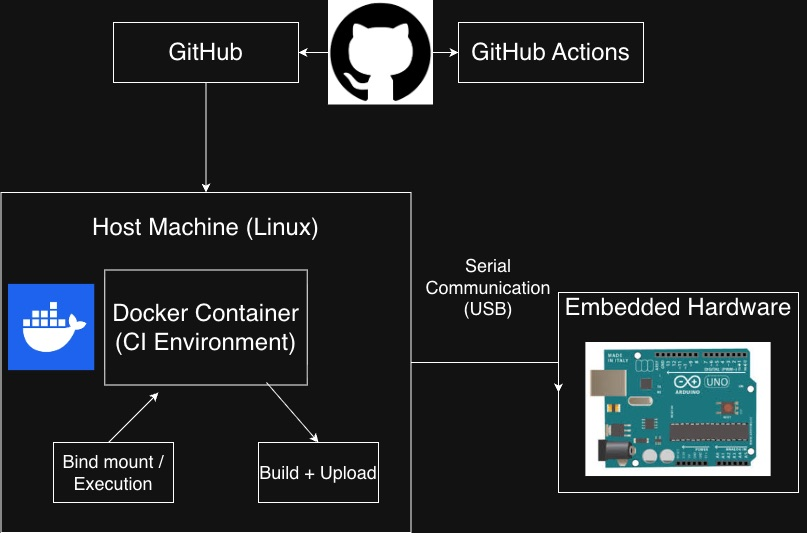

# Method of approach

## System Overview

The GDBuddy system is designed to facilitate automated testing on embedded hardware. The primary goal of doing this is to allow students and faculty alike to be able to conveniently, reliably, and securely run code on real physical hardware. The benefits of this approach are numerous. First off testing on real hardware, as mentioned prior, allows for more accurate feedback on the behavior of code in real deployment conditions. Along with this approach it allows for hardware to be "shared" by allowing for multiple students to run code on the physical device through the self-hosted runner. This runner would be connected to a host pc through USB interface which allows for simple repeatable connection.This is not only cost effective but fair and convenient. Students simply push their code to GitHub as they normally would and the system takes care of the rest.

## Hardware-in-the-Loop Architecture

The system follows a hardware-in-the-loop (HIL) architecture in which code compilation and occurs in a software based CI environment, while execution occurs on a physical embedded device. In this model, the microcontroller acts as the final authority on program correctness which allows for hardware specific behaviors to be observed during automated testing. This approach allows for real deployment conditions compared to simulators. The separation between the CI orchestration layer and the hardware execution layer also enables repeatable experiments as the device can be reset between runs to ensure a consistent starting state.

### Hardware Components

The primary execution target for the system is the Raspberry Pi Pico, which is based on the RP2040 ARM Cortex-M0+ microcontroller. The Raspberry Pi Pico WH was selected due to the low cost (~$7 USD), wide availability, and strong support of open source embedded development tools. Along with this it is already commonly used in embedded systems courses and projects which makes it a natural choice for this project. Along with this the specs of this device teach students realistic limitations they would encounter in real embedded systems. The microcontroller includes 264 KB of on chip SRAM and does not incorporate a memory management unit (MMU) reflecting the resource constraints of bare-metal embedded environments. This board also includes 2 MB of onboard QSPI flash memory for program storage, connected externally to the RP2040. It provides 26 multifunctional general purpose input/output (GPIO) pins, including support for UART, SPI, PWM, I2C, and ADC interfaces. 

The Pico is powered and programmed through a USB interface which, which is used by the system for both firmware deployment and serial communication. The Pico has no onboard operating system which ensures minimal software overhead and consistent execution timing across runs. While the board's limited memory and processing resources constrain the complexity of executable programs, these constraints are representative of real world microcontroller based systems and are there for educationally valuable for understanding how to develop efficient code for embedded environments.

A host machine running Docker serves as the self hosted GitHub Actions runner and coordinate all interactions with the connected hardware. This host is responsible for building firmware, flashing the microcontroller, resetting the device between runs, and collection execution output via the USB interface. This separation between orchestration and execution enables automated testing while maintaining direct interaction with physical hardware

### Software Components

The software setup is consisted of several key components that work together to enable the hardware-in-the-loop testing workflow. The software stack is built around GitHub Actions which provides the integration framework used to trigger and manage automated workflows. The use of a self-hosted runner is required in order to provide direct access to physical hardware, which is not possible with GitHub-hosted runners. 

Docker is the software used to containerize and build the deployment environment. Docker was selected for this role due to its widespread adoption, extensive documentation, and strong support for GitHub Actions workflows. Its ease of use and documentation has led it to be a common choice for for containerized environments across industry and academia. Docker allows for consistent toolchains and dependencies across runs which is why it is used in GDBuddy. 

Compared to alternative containerization technologies, Docker provides a practical balance between isolation, usability, and ecosystem support. Rootless container systems such as Podman offer similar isolation guarantees but introduce additional configuration complexity when integrating with existing GitHub Actions tooling and USB device passthrough. Lightweight container approaches such as LXC provide lower-level isolation but require more manual setup and are less commonly supported in CI based workflows. High performance container solution such as singularity are primarily designed for high performance computing environments and are less suited to interactive CI pipelines involving hardware access. 

The containerized execution environment is defined using a Dockerfile, which specifies the required toolchains and dependencies needed to build and deploy the firmware for the Raspberry Pi Pico. THis includes compiler tools, SDK components, and flashing utilities, ensuring that all jobs execute within a consistent reproducible environment. By encapsulating these dependencies within the container image, the system avoids reliance on host specific configurations and reduces variability across executions.

Hardware deployment is managed using OpenOCD, which provides a standardized interface for flashing firmware and resetting the microcontroller. OpenOCD enables automated integration with the Raspberry Pi Pico over USB and is integrated into the CI workflow ot support programming and execution. Configuration scripts are used to make OpenOCD target the device and ensure consistent initialization between runs. 

An entrypoint script orchestrates the execution flow within the container by coordinating build, deployment, and execution steps. This script acts as the control layer between GitHub Actions and the containerized environment, ensuring that firmware compilation, device flashing, program execution, and output collection occur in a defined order. Centralizing this logic in the entrypoint script simplifies workflow configuration and improves maintainability of the overall system. 

## Continuous Integration Workflow

The continuous integration workflow serves as the orchestration layer that coordinates compilation, deployment, execution and evaluation across the system. The workflow execution is triggered automatically whenever code is pushed to the repository. 

By embedding hardware execution within a CI framework, the system leverages existing version control and automation infrastructure to support scalable and repeatable evaluation. This approach allows for embedded code to be assessed using the same submission and feedback mechanisms that are commonly used in software development, while extending them to physical hardware execution. This workflow is likely to be familiar to students and faculty alike which allows for GDBuddy to be easily adopted.

## Containerization and Isolation Strategy

Containerization is used to enforce isolation boundaries between submitted code, the host system, and the shared hardware environment. Containers define the scope of execution by constraining filesystem access. By doing this it means that if a user is trying to access the hosts system they will only be able to access the container filesystem, not the hosts real filesystem. By the process visibility being limited it means that host processes and other CI jobs are out of the scope if there were to be a malicious attempt.This approach reduces the risk of unintended interactions between submissions and limits the impact of misbehaving code. It is worth mentioning that containers do share the host kernel therefore kernel level exploits could impact the host however this threat is mitigated by the fact that the system runs in a controlled academic environment meaning that repository access is restricted by the organization. 

Each job executes in a fresh container instance meaning that after completion of one job the container is destroyed, the filesystem state is discarded, and memory allocations are released. This grantees that there is no cross submission contamination and there are reproducible build conditions within this workflow.

Along with these security benefits, containerization also provides a huge help in ensuring consistent runtime dependencies. By containerizing the toolchain and execution environment there can be no variability in what tools are being used. This creates a fair standard to evaluate all submissions as it is guaranteed that all of the submissions are being built and executed in the same environment. If it was not for containerization there would inevitably be some scenarios where it would work on one machine but not another due to differences in toolchain versions or host configurations.

## System Architecture

The GDBuddy system is built around a hybrid architecture that integrates cloud based automation with locally connected embedded hardware. As shown in the figure above, the system consists of three primary layers: GitHub, a host Linux machine running a self-hosted runner, and the embedded hardware device. This design allows the system to bridge modern continuous integration workflows with real physical hardware, enabling automated hardware-in-the-loop testing.

At the top level, GitHub serves as the source control platform and entry point for the workflow. When code is pushed to a repository, a GitHub Actions workflow is triggered automatically. These workflows are defined using YAML configuration files, which specify the sequence of steps required to build, test, and execute code. The use of YAML is important because it allows the workflow to be version controlled alongside the codebase, making the testing process transparent and reproducible. This ensures that every test run follows the exact same procedure, reducing inconsistencies and improving reliability.

Once triggered, the workflow is executed on a self-hosted runner located on a Linux machine. This component is critical to the system’s functionality. Unlike cloud hosted runners, which operate in isolated virtual environments, a self hosted runner has direct access to local hardware resources. This allows the workflow to interact with physical devices connected to the system. In GDBuddy, the Linux host acts as the central control point, receiving instructions from GitHub and coordinating all subsequent operations.

Within the Linux host, a Docker container is used to provide a consistent and isolated execution environment. The container includes all necessary tools, such as compilers, libraries, and scripts required to build and deploy the embedded code. By using Docker, the system avoids issues related to dependency mismatches or configuration differences between machines. This is especially important in collaborative settings, where developers may be working across different systems. The container ensures that all builds and tests are performed in a controlled environment, leading to more consistent results.

The final layer consists of the embedded hardware, such as an Arduino or Raspberry Pi Pico, which is connected to the host machine via USB. Communication between the host and the device occurs over a serial interface, which allows data to be transmitted between the two systems. Through this connection, the host machine can upload compiled code to the microcontroller, initiate execution, and receive output data. This enables real-time interaction with the hardware, which is essential for validating embedded system behavior.

An additional important aspect of the architecture is how data flows through the system. After code is pushed to GitHub, the workflow triggers, executes within the Docker container, and then interacts with the hardware through the host machine. Results from the hardware are then captured and sent back through the pipeline, where they are logged and displayed within the GitHub Actions interface. This closed-loop system provides immediate feedback to the developer, similar to traditional software CI pipelines, but with the added complexity of physical hardware.

Error handling and reliability are also key considerations in this design. Failures can occur at multiple stages, including build errors, container failures, or communication issues with the hardware. GDBuddy addresses these challenges by leveraging built-in logging from GitHub Actions and structuring workflows to clearly report failures. This makes debugging more straightforward and ensures that users can identify where issues occur in the pipeline.

Overall, the architecture of GDBuddy effectively combines cloud based automation, containerized environments, and physical hardware interaction. This integration allows for scalable, reproducible, and efficient testing of embedded systems, making it well suited for both educational and development environments.

## Security and Access Control

Whenever looking at the primary security concerns of GDBuddy there are a couple that stand out as being a possible problem. These include 

- Unauthorized access to the host machine

- Interference with concurrent CI jobs

- Unauthorized access to hardware peripherals 

- Resource exhaustion attacks (infinite loops, excessive memory usage etc.)

The first layer of defense against all of these attacks is the repository access control. Hardware execution workflows are restricted to the repositories within a controlled organization. Only trusted repositories are permitted to trigger workflows that access the self hosted runner. In order to access the runner you must have membership within the organization, the appropriate repository permissions, and workflow configuration approval. This ensures that external repositories cannot run jobs on the self hosted runner. 

The self hosted runner operates within a controlled environment and is not publicly exposed. Because the runner has direct USB access to hardware the attack surface is significantly reduced as it is not connected to the runner over any network rather it is connected through direct USB access. 

The Docker based isolation strategy employed by GDBuddy provides multiple layers of security boundaries, though it is important to understand both the protections offered and their limitations. Docker containers use Linux kernel features such as namespaces and control groups to create isolated execution environments. Namespaces restrict what a container can see process IDs, network interfaces, filesystem mounts, and user IDs are all isolated from the host system. This means that processes running inside the container cannot directly observe or interact with host processes, providing a meaningful security boundary.

Control groups complement namespaces by limiting what a container can consume. They enforce resource constraints on CPU usage, memory allocation, disk I/O, and network bandwidth. In the context of GDBuddy, control groups prevent a poorly written or malicious developer submission from exhausting system resources and interfering with concurrent workflows or the host system's operation. For example, an infinite loop that allocates memory continuously will eventually hit the container's memory limit and be terminated, rather than consuming all available system memory and causing the host machine to become unresponsive.

However, these isolation mechanisms are not absolute. Containers share the host kernel, which means that kernel level vulnerabilities could potentially be exploited to escape the container and gain host access. This represents a fundamental limitation of container based isolation compared to full virtual machines, which provide complete kernel isolation. In the context of GDBuddy, this risk is mitigated by the controlled environment in which the system operates. Repository access is restricted to trusted users within the organization, and workflows must be explicitly configured to run on the self hosted runner, preventing arbitrary external code execution.

The USB device passthrough required for hardware communication introduces an additional security consideration. Docker's device flag allows specific hardware devices to be mapped into the container, granting direct access to the USB connected microcontroller. This access is necessary for the system's functionality but also means that code executing within the container has the capability to interact with the physical hardware. Malicious code could potentially attempt to damage the device through improper programming sequences or by exploiting firmware vulnerabilities.

To address this, GDBuddy implements several protective measures. First, the USB devices passed into the container are limited to only the specific microcontroller being tested—no access is granted to other USB devices, storage drives, or system peripherals. Second, the flashing and communication utilities (such as OpenOCD and serial communication tools) are configured with minimal privileges and operate with predefined scripts rather than accepting arbitrary commands. Third, the container filesystem is out of scope, meaning that any modifications made during execution are discarded when the container terminates, preventing possible compromise.

## Ethical Considerations and Mitigations

The GDBuddy system is designed for use in an educational setting where fairness, transparency, and student privacy are critical concerns. The system automates grading and executes student submitted code on shared hardware, ethical consideration were incorporated into the architectural design. 

A key ethical objective of the system is to prevent unequal academic advantage arising from disparities in hardware availability. In traditional embedded systems courses, students with personal access to hardware may gain additional debugging time and real device exposure compared to student who rely solely on lab access. GDBuddy mitigates this imbalance by providing standardized access to identical hardware, executing all submissions on the same device configuration, and eliminating variability due to personal development environments. This ensures every students code is compiled and executed under identical hardware and software conditions, the system promotes equitable evaluation. 

Automated grading systems can raise concerns regarding opaque evaluation criteria. To address this, GDBuddy emphasizes transparency through clearly defined pass/fail conditions, logged serial output visible to students, and deterministic execution environments. Because the containerized toolchain and device configuration are fixed and version controlled the results are reproducible. If a submission passes or fails, the same outcome can be recreated under identical conditions. 

The system is intentionally limited in scope to program execution and output capture. It does not monitor student development environments, collect personal data beyond repository activity, or record behavioral usage analytics. The self-hosted runner processes only the code committed to the repository and the resulting execution output. No additional metadata or monitoring mechanisms are incorporated into the system design. By restricting data collection to the minimum required for automated evaluation the system adheres to the principles of data minimization nad purpose limitation.

While automation increases scalability and consistency it reduces opportunities for manual instructor review during routine testing. To mitigate this, the system is intended to supplement not replace instructor oversight. Automated results can be audited and instructors retain final grading authority. 

- Prevent unfair academic advantage by ensuring all student execute code on identical hardware 

- Transparency in grading logic ensures fairness and reproducibility 

- System designed for educational use, not surveillance or student monitoring

## Limitations of the Method

While GDBuddy provides a practical and reproducible framework for hardware-in-the-loop testing, several limitations constrain its scalability, gerneralizability, and operational robustness.

The system relies on physical embedded hardware, which inherently limits scalability. Unlike purely virtual CI pipelines that can scale using cloud resources, hardware-in-the-loop systems are bounded by the number of available boards, self-hosted runners, and physical USB port availability. Each workflow requires execution and exclusive access to a physical device. Therefore the jbo capacity is limited ot the number of connected boards. As course enrollment increases, additional hardware runner instances must be provided manually. This constrain reflects a fundamental tradeoff between executional realism and scalability.

Physical hardware introduces potential points of failure not present in purely software-based CI systems. This includes USB connection stability, flash memory corruption, and power interruptions. Hardware failure during a CI run may result in workflow interruption or false results. WHile device reset procedures mitigate some failures catastrophic hardware faults require manual intervention. As a result, operation reliability depends not only on software correctness but also on hardware stability. 

The current implementation supports only the Raspberry Pi Pico platform and is designed for Linux and Windows host systems. This device specificity introduces several constraints. 

- Toolchains and flashing utilities are RP2040 specific

- OpenOCD configuration scripts are device dependant 

- Build processes assume Pico SDK compatibility

Extending support to additional microcontroller would require 

- Alternate SDK configuration

- Device specific flashing workflows

- Modified USB access configurations

Similarly, macOS host support may require additional USB permission handling and driver configuration adjustments.
The current system is optimized for a single hardware ecosystem rather than a generalized embedded platform abstraction. 
