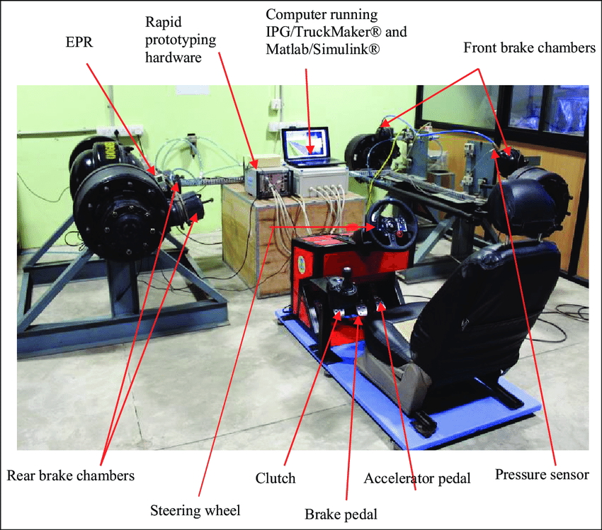

# Related work

There are a variety of different sources that are relevant to GDBuddy ranging from peer reviewed academic papers to GitHub repositories. This section is a deeper dive into the workspace surrounding HIL testing, GitHub Actions Runners, Docker, and the Raspberry Pi as all of these things are relevant to the workspace of GDBuddy.

## History of HIL

The history of Hardware-in-the-Loop (HIL) technology is broad, layered, and often difficult to pin down to a single definition. Because HIL sits at the intersection of simulation and physical hardware, its boundaries have shifted over time as both computing power and engineering needs have evolved. Early examples such as flight and vehicle simulators blur the line between simulation and full hardware integration, yet they are still considered HIL because they place a human or subsystem in a test environment that mimics real world conditions, even when significant portions of that environment remain virtual [@brayanov2019hardwareinloop]. Most strict definitions, on the other hand, emphasize systems where real physical components interact with simulated ones in real time, such as an actual turn signal responding to driver input. 

The history of HIL is a very broad yet interesting subject. There is no real formal definition of what HIL actually is. This means that things such as flight or driving simulators are considered to be HIL systems even when there is a large portion of simulation involved in the testing environment[@brayanov2019hardwareinloop]. There are also the more strict examples of HIL which actually includes using real hardware such as the turn signal flashing whenever you pull the correct lever. These short examples go to show the broadness of this technology and how it has been incorporated in industry. While GDBuddy explores the education sector which has been almost completely untouched by HIL technology it is important to understand the background of this topic and how it needs to be expanded on into the future.

### Flight Simulation

One of the first recognized examples of HIL systems is a flight simulator created in 1910 by the "Saunders Teacher"[@baarspul1990flightsimulation]. The physical hardware in this setup was a real grounded airplane with a pilot inside. This was meant so the pilot could feel the effects of the wind in the plane while grounded and not have to risk this feeling happening for the first time when flying. While this wasn't very effective because you can not control the wind it showed one of the first documented examples of HIL testing. This is also an interesting example to follow because you can see how this technology has evolved over the decades.

For a long time after this there was really no significant increase in the technology of these simulators because the hardware or computers at the time could simply not achieve the requirements needed to set up a quality virtual environment to test how the plane might respond with wind or different things of that nature. Around the 60s and 70s when you start to see some real progress whenever it comes to HIL systems. This is due to the increase in hardware capabilities as well as the need to test more complex systems such as cars or spacecraft that inherently have a high risk associated with them failing. Along with this risk needing to be addressed it also addressed an efficiency issue. If you can break a larger system down into its smaller parts and test them individually it will save time in the development cycle to find out what specific part is failing before combining all of the technologies together and then having to strip it back down to fix it. 

### Government Use

The United States Government plays a large role in the history of HIL development as a lot of industries encapsulated by this technology were underneath the scope of the government. It was continuously used in the flight and missiles control industry and more specifically the Sidewinder program. Along with this it was something that was greatly used by NASA as well when it came to testing spacecrafts. These industries were also accelerated due to the arms race created by the tensions of the Cold War. It makes sense that the government would be a main user of this type of technology as they can afford the technology and work on projects big enough where it makes sense to go in depth and create an advanced HIL tester for a specific given technology such as a spacecraft or missile guiding system. 

### Apollo Missions

There is a somewhat recent history. One of the earliest documented uses of this method was by NASA during the Apollo missions which ranged from 1960-1973. The intense pressure of the space race forced a need to reduce development cycles. Although the intense pressure to develop quickly is the need for safety. Meeting safety requirements requires extreme amounts of testing before using on a real machine. When working with spaceships failures are expensive, very expensive. The United States Federal Government spent $25.8 billion over that time period. That is the equivalent to $318 billion in 2023. The Launch vehicle alone cost $185 million in 2025 that would equate to roughly $1.6 billion. This goes to show how expensive failures could be especially later in the design cycle. HIL testing was not created as a want but more so as a need in order to win the space race which was a huge political issue at the time. 

### Automotive Industry

The automotive industry started in a similar fashion to the flight industry.[@2018hilreview] The earliest use of HIL was used with a vehicle driving simulator. These were useful for testing how to actually interact with the systems as a driver but did not provide real simulation of the actual driving systems such as the gas and brake. However the newer versions of HIL in this industry are more similar to what some would consider real HIL testing. In 1987, HIL was used to test the anti-lock braking system (ABS) development, using an electric motor to simulate the engine while the braking system operated under realistic conditions. A year later in 1988, HIL was expanded for evaluating Anti-Slip Regulation (ASR), allowing engineers to assess performance and quality under controlled slip and traction conditions. These steps marked the shift toward modern, fully functional automotive HIL testing. HIL was a good choice for testing these systems because these systems are important to first off protect the safety of the people driving the car and secondly in order to protect the car itself from crashing. Being able to test these specific systems in a controlled environment almost certainly leads to a faster and cheaper production cycle. 

Figure 3 [@2018hilreview]

The figure above is from an article published in 2018 looking into air brake systems in heavy commercial road vehicles (HCRVs). In this figure you can see the amount of largely specified equipment required to set something like this up. For this specific example the real brake system is being used. The simulation software IPG/TruckMaker® were responsible for creating this environment. IPG Xpack4 is the hardware that serves as a Real-Time Rapid Control Prototyping tool. This real time controller was equipped with a multitude of sensors in order to collect data related to the effectiveness of the braking system. This setup shows what a pretty modern HIL system looks like and how it is used in order to create a very realistic environment to test specific parts in. 

This is one of many examples that goes to show the use of HIL technology in other industries. This being brought to the education industry could provide great benefits. Being able to safely test code on real hardware allows for students to be evaluated in a safe and fair manner. It also allows for classrooms with limited hardware devices to be able to run their code on something like the Raspberry Pi.

### Costs

As mentioned above HIL has been used on extremely expensive projects, but how much does HIL itself actually cost? In the 1990s the first self designed simulator cost slightly over EUR 100,000 and the second identical unit cost roughly EUR 25,000. At the time this was considered to be a deal compared to the multi million dollar unmanned aerial vehicles (UAVs) they were developing. This made it make a lot of sense to invest in this technology from a business perspective because if it would stop the crashing of just one of these UAVs they would make their money back and possibly save lives of innocent people. Along with this benefit it allowed software to be developed and tested without having to wait for all of the actual hardware to be built or flown. However these are not available to be widely purchased. So where does the market exist? There is a market for large industrial level HIL testers that are specific to aircraft or automotive which are extremely specialized. For more modest setups like this there are a few applications that exist on the market but the odds are that you won't find one that does exactly what you want. This means that developers are often left to try to create their own or just completely forgo using HIL. This is why GDBuddy would be so beneficial to the educational sector, it allows for students to have access to HIL testing leading to them having the something in common with developers at NASA![@mihalic2022hardwareinloop]

Although industrial HIL systems remain prohibitively expensive, the educational counterpart does not need to operate at the same scale. A GDBuddy style setup is intentionally lightweights relying on inexpensive and widely available hardware. A typical student configuration requires a Chromebook or similar low cost laptop, a Raspberry Pi (Only 1 required per class as runner device) for embedded execution, and a standard USB cable to interface with the device. Even when accounting for classroom scale deployment, the total hardware cost is only a small fraction of traditional HIL systems and can be easily under $150 USD. This stands as a strong contrast to the multi million dollar price range of industrial HIL platforms. 

The affordability of this setup meaningfully changes who can access HIL. Instead of being restricted to aerospace, defense, or automotive industries with multimillion dollar budgets, GDBuddy enables students, educators, and smaller institutions to run real HIL tests as part of everyday coursework. This ease of access in HIL tools is extremely valuable for its cost and mirrors the larger trends in computing. By reducing the barriers of cost and specialized equipment, the GDBuddy model provides a pathway for educational environments to benefit from the same development principles historically reserved for organizations like NASA or major automotive manufactures. [@mihalic2022hardwareinloop]

## HIL fundamentals

Hardware-in-the-loop (HIL) is a testing methodology where real hardware is integrated into a system to enable testing a verification that the software can run on the real system as opposed to simulating that system. 

### Early Industrial Applications

Traditionally, HIL  has been used in industries like aerospace, automotive, power electronics, and robotics, where testing physical systems directly can be dangerous and costly. In aerospace early HIL systems were employed to test flight control systems, autopilots, and aircraft navigation tools. Engineers required deterministic real time testing to ensure that software controlling aircraft responded accurately under variable conditions. Similarly, the automotive industry adopted HIL testing for engine control units, braking systems, and advanced driver assistance systems (ADAS). These applications emphasized precise timing, feedback, and comprehensive error monitoring given the potential for consequences of a failed system. In these industries a normal practice is to put a certain component under test. This is called the hardware under test (HUT). This hardware is then coupled with a computation model of the rest of the system creating a closed environment where interactions can be controlled and measured in real time. By connecting the HUT to  a computational model of the broader system, engineers can control inputs and measure outputs in real time, creating a closed loop testing environment that replicates realistic conditions while maintaining safe controlled settings [@mihalic2022hardwareinloop].

### Evolution of HIL Technology

Many early HIL systems were designed for validating flight control systems, engine management units, and industrial controllers. These systems emphasized deterministic, real-time execution. Through doing this the HUT receives inputs and returns outputs in a controlled environment where systems can be stressed and analyzed. As the technology developed HIL setups have turned to all sorts of different interfaces such as digital sensors, serial and controller area network (CAN) communications, and multi-device interactions. 

[@mihalic2022hardwareinloop] provides a wide overview of the historical development of HIL systems and how they technically worked. This article highlights the important technological advancements as well as the ongoing challenges. It identifies several recurring engineering issues such as the balance between model fidelity, computational cost, the complexity of interfacing heterogeneous hardware (systems that use multiple types of processors), and the need for reproducibility in testing. This is a great example of the industrial or commercial use cases of HIL are and some of these concepts translate well to smaller projects that can make this type of service more accessible.

Figure 2A

This figure shows how an (a) embedded system connects to a HIL simulator and (b) the components of a HIL simulator. This model differs from GDBuddy because the Raspberry Pi is a single board setup that does not have a system setup around it outside of its host PC. This is a rather simplified graphic compared to looking at all of the real components that could be encapsulated by "Input hardware", "Input software", "Output software", and "Output hardware". In the example of GDBuddy the input hardware would be the physical electrical interface of the Raspberry Pi. The input software would be the container that is used for testing but more importantly would be the users repository that was pushed to the runner. The output software is the collected logs, test results, and program output that is returned to the user after it is run through GitHub Actions on a physical Raspberry Pi. The output hardware may not always apply in the case of GDBuddy however if there was an assignment where one would have to make an LED light up that would be an example of hardware output in context of GDBuddy.

### Current State of the Art

Existing approaches to embedded systems testing and validation vary widely in complexity, cost, and accessibility. Traditional solutions such as. manual lab testing, dedicated hardware testing frameworks, and large scale automated validation systems each provide different trade offs. GDBuddy was designed to address gaps in accessibility, cost efficiency, and integration with modern development workflows. 

A key distinction between GDBuddy and existing solutions is its ability to integrate directly with GitHub Actions, enabling hardware-in-the-loop testing as part of a continuous integration pipeline. Many existing systems, such as Zephyr’s Twister framework, support automated testing but require significant setup time and familiarity with complex build systems. In contrast, GDBuddy reduces setup overhead by leveraging containerization and standardized workflows.

Cost is another major differentiator. Industry grade systems such as LAVA are designed for large scale infrastructure and require substantial hardware investment and maintenance. While these systems provide powerful testing capabilities, they are impractical for classroom environments or individual student use. GDBuddy, by comparison, can be deployed using a Raspberry Pi and microcontroller for under $150, making it significantly more accessible.

From an educational perspective, ease of use is critical. Traditional lab setups often require manual code deployment, physical interaction with hardware, and instructor supervision. While this provides valuable hands-on experience, it limits scalability and introduces inconsistency in testing. GDBuddy automates this process while still allowing students to interact with real hardware, preserving the benefits of physical systems while improving reproducibility.

Another important factor is the learning curve. Many existing frameworks assume prior experience with embedded systems, virtual environments, and build pipelines. GDBuddy lowers this barrier by using familiar tools such as GitHub and Docker, allowing students to focus on system behavior rather than setup complexity.

Overall, GDBuddy represents a middle ground between fully manual testing and enterprise scale automation systems. It provides a low cost, reproducible, and scalable solution that aligns well with modern software development practices while remaining accessible to students and educators as well as collaborative embedded developers.

### Increasing Automation and Accessibility 

The development of HIL also reflects a shift from manual benchmark testing to automated frameworks. Early systems required engineers to manually configure and monitor each test scenario. Modern HIL platforms tend to use more automation for test execution, data collection, and error analysis. These historical trends provide context for GDBuddy, which aims to combine HIL testing with automated CI workflows in an accessible platform.

## Related Articles

[@mihalic2022hardwareinloop] is one of the primary references for looking at the history of HIL specifically for industrial and commercial use. They describe the challenges of real time simulation, fidelity trade offs, hardware interfacing, and reproducibility. It also notes that while HIL is widely used in industrial contexts it remains somewhat unexplored in low cost CI environments which is the gap GDBuddy plans to fill. This will also be re-iterated when looking at relevant GitHub repositories.

As mentioned prior the aerospace industry was one of the first documented cases of HIL testing. Evan and Schilling (1984) [@EvansSchilling1984] describe how simulation was used alongside real hardware  flight testing to validate control systems for experimental aircraft. Rather than relying only on mathematical models, the project progressively integrated physical components into closed loop setups to evaluate stability, control response, and flight behavior under realistic conditions. This early approach mirrors the core principles of modern HIL methodology. There was a need for a more isolated yet real environment to evaluate system performance in safety critical contexts and that is why HIL was initially getting its use.

Although Evan and Schilling's [@EvansSchilling1984] work predates modern automation frameworks, it provides a foundational example of why real hardware testing is not only good but has become the gold standard when it comes to high safety liable systems. The authors emphasize that simulation alone could not capture all failure modes or physical interactions, especially those related to aerodynamic feedback, rapid maneuvering, and full system integration. These historical insights are the same motivations that inspired GDBuddy. The ability to bridge the gap between simulated development environments and real execution on physical hardware systems. By providing students and developers access to real hardware execution early in the development cycle GDBuddy follows the same philosophy as its predecessors: simulation is useful for efficiency but only physical execution can fully reveal the behaviors of the system.

Brayanov's Review of Hardware-in-the-loop a Hundred Years Progress in the Pseudo-Real Testing [@brayanov2019hardwareinloop] provides one of the broadest historical overviews of HIL development across multiple engineering domains. Where much of the existing literature focuses on specific industries, Brayanov traces HIL's evolution from early analog simulators to modern digital real time systems. A key contribution of this review is its emphasis on how different fields such as automotive, aerospace, energy, and robotics adopted HIL independently but converged on similar motivations. Improving safety, reducing development costs, and validating edge-case behaviors that pure simulation cannot capture reliably. The article also highlights how increasing computational power and more advanced real time hardware expanded the scope of HIL from simple component testing to full system, high fidelity experimental setups. This broader lens is useful for contextualizing GDBuddy, which represents the next step in expanding HIL beyond traditional industrial settings into lightweight, accessible CI driven environments for education and rapid development. 

## Related GitHub Repositories

There is a clear gap in HIL and that can be seen from searching the tag on GitHub. When filtering for #hardware-in-the-loop there are only 37 public repositories on GitHub. Out of these repositories many of them are simulating HIL. Also out of these 37 repositories there are less than 5 that currently use the Raspberry Pi as their embedded device of choice. While there is a gap in this area specifically there are still some repositories that are related to GDBuddy in a less specific way. 

The jumpstarter-dev / jumpstarter repository [@jumpstarter] is a very interesting tool in this space. It is a free open source tool that can run automated tests on real and virtual hardware that has CI/CD integration. It allows for unified testing for local, virtual and remote hardware. It also uses a python testing ecosystem which can be seen as a large benefit. It is also important to note that this tool works on macOS and Linux. This is more of a general purpose test orchestration tool and is not specific to the Raspberry Pi or embedded education workflows however it is a much broader tool that certainly has its use cases in the HIL field. 

A great example of this would be the raspberrypi / pico-examples repository[@pico_examples]. This repository shows how to actually configure your local raspberry pi and gives a list of commands that may be useful in doing so. Also it being made by the developers of Raspberry Pi makes it a reliable source to find information about different commands and what they are used for. 

## Where Does GDBuddy Fit?

Overall, while there are some tools and repositories that touch on aspects of HIL, the space remains largely underdeveloped for educational and embedded contexts, particularly with Raspberry Pi integration. Existing projects like jumpstarter provide robust test orchestration for a range of hardware but are general-purpose and not tailored for hands-on learning or classroom use. Likewise, the pico-examples repository is useful for device setup and basic experimentation but does provide a full HIL testing framework. This gap highlights the need for tools like GDBuddy, which aim to bridge the divide by offering accessible and real HIL experiences for students and educators, combining practical learning with safe and reproducible testing environments. 