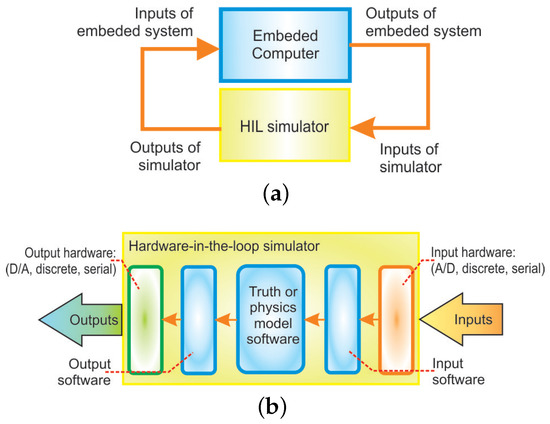

# Related work

There are a variety of different sources that are relevant to GDBuddy ranging from peer reviewed academic papers to GitHub repositories that are doing similar things. This section is a deeper dive into the workspace surrounding HIL testing, GitHub Actions Runners, Docker, and the Raspberry Pi as all of these things are relevant to the workspace of GDBuddy. 

## HIL fundamentals and Historical Development

Hardware-in-the-loop (HIL) is a testing methodology where real hardware is integrated into a system to enable testing a verification that the software can run on the real system as opposed to simulating that system. Traditionally, HIL  has been used in industries like aerospace, automotive, power electronics, and robotics, where testing physical systems directly can be dangerous and costly. In aerospace early HIL systems were employed to test flight control systems, autopilots, and aircraft navigation tools. Engineers required deterministic real time testing to ensure that software controlling aircraft responded accurately under variable conditions. Similarly, the automotive industry adopted HIL testing for engine control units, braking systems, and advanced driver assistance systems (ADAS). These applications emphasized precise timing, feedback, and comprehensive error monitoring given the potential for consequences of a failed system. (Gordon et al., 2019). In these industries a normal practice is to put a certain component under test. This is called the hardware under test (HUT). This hardware is then coupled with a computation model of the rest of the system creating a closed environment where interactions can be controlled and measured in real time. By connecting the HUT to  a computational model of the broader system, engineers can control inputs and measure outputs in real time, creating closed loop testing environment that replicates realistic conditions while maintaining safe controlled settings (Mihalic et al., 2022).

Many early HIL systems were designed for validating flight control systems, engine management units, and industrial controllers. These systems emphasized deterministic, real-time execution. Through doing this the HUT receives inputs and returns outputs in a controlled environment where systems can be stressed and analyzed. As the technology developed HIL setups have turned to all sorts of different interfaces such as digital sensors, serial and controller area network (CAN) communications, and multi-device interactions. 

Mihalic et al. (2022) provides a wide overview of the historical development of HIL systems and how they technically worked. This article highlights the important technological advancements as well as the ongoing challenges. It identifies several recurring engineering issues such as the balance between model fidelity, computational cost, the complexity of interfacing heterogeneous hardware (systems that use multiple types of processors), and the need for reproducibility in testing. This is a great example of the industrial or commercial use cases of HIL are and some of these concepts translate well to smaller projects that can make this type of service more accessible.

Figure 2A

This figure shows how an (a) embedded system connects to a HIL simulator and (b) the components of a HIL simulator. This model differs from GDBuddy because the Raspberry Pi is a single board setup that does not have system setup around it outside of its hosts PC. This is a rather simplified graphic compared to looking at all of the real components that could be encapsulated by "Input hardware", "Input software", "Output software", and "Output hardware". In the example of GDBuddy the input hardware would be the physical electrical interface of the Raspberry Pi. The input software would be the container that is used for testing but more importantly would be the users repository that was pushed to the runner. The output software is the collected logs, test results, and program output that is returned to the user after it is ran through GitHub Actions on a physical Raspberry Pi. The output hardware may not always apply in the case of GDBuddy however if there was an assignment where one would have to make an LED light up that would be an example of hardware output in context of GDBuddy.

The development of HIL also reflects a shift from manual benchmark testing to automated frameworks. Early systems required engineers to manually configure and monitor each test scenario. Modern HIL platforms tend to use more automation for test execution, data collection, and error analysis. These historical trends provide context for GDBuddy, which aims to combine HIL testing with automated CI workflows in an accessible platform.

## Related Articles

Mihalic et al. (2022) is one of the primary references for looking at the history of HIL specifically for industrial and commercial use. They describe the challenges of real time simulation, fidelity trade offs, hardware interfacing, and reproducibility. It also notes that while HIL is widely used in industrial contexts it remains somewhat unexplored in low cost CI environments which is the gap GDBuddy plans to fill. This will also be re-iterated when looking at relevant GitHub repositories.

As mentioned prior the aerospace industry was one of the first documented cases of HIL testing. Evan and Schilling (1984) describe how simulation was used alongside real hardware  flight testing to validate control systems for experimental aircraft. Rather than relying only on mathematical models, the project progressively integrated physical components into closed loop setups to evaluate stability, control response, and flight behavior under realistic conditions. This early approach mirrors the core principles of modern HIL methodology. There was a need for a more isolated yet real environment to evaluate system performance in safety critical contexts and that is why HIL was initially getting its use.

Although Evan and Schilling's work predates modern automation frameworks, it provides a foundational example of why real hardware testing is not only good but has become the gold standard when it comes to high safety liable systems. The authors emphasize that simulation alone could not capture all failure modes or physical interactions especially those related to aerodynamic feedback, rapid maneuvering, and full system integration. These historical insight are the same motivations that inspired GDBuddy. The ability to bridge the gap between simulated development environments and real execution on physical hardware systems. By proving students and developers access to real hardware execution early in the development cycle GDBuddy follows the same philosophy as its predecessors: simulation is useful for efficiency but only physical execution can fully reveal the behaviors of the system.

## Related GitHub Repositories

There is a clear gap in HIL and that can be seen from searching the tag on GitHub. When filtering for #hardware-in-the-loop there are only 37 public repositories on GitHub. Out of these repositories many of them are simulating HIL. Also out of these 37 repositories there are less than 5 that currently use the Raspberry Pi as their embedded device of choice. While there is a gap in this area specifically there are still some repositories that are related to GDBuddy in a less specific way. 

A great example of this would be the raspberrypi / pico-examples repository. This repository shows how to actually configure your local raspberry pi and gives a list of commands that may be useful in doing so. Also it being made by the developers of Raspberry Pi makes it a reliable source to find information about different commands and what they are used for. 